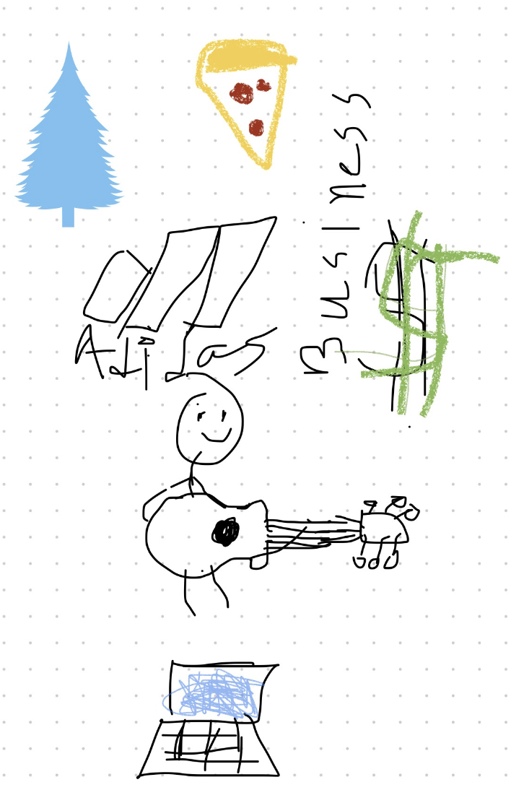

## Deva's Page 
Go to my [Github account](https://github.com/devaSas1) !!
==================

## About Me
I'm 15 years old, I play guitar, I love cars, coffee, business, and occasionally I make youtube videos about fitness and such. I haven't enjoyed programming in the past, and I hope that with this experience of coding my own blog  

- Plans, Lists, [Scrum Boards](https://clickup.com/blog/scrum-board/) help you to track key events, show progress and record time.  Effort is a big part of your class grade.  Show plans and time spent!
- [Hacks(Todo)](https://levelup.gitconnected.com/six-ultimate-daily-hacks-for-every-programmer-60f5f10feae) enable you to stay in focus with key requirements of the class.  Each Hack will produce Tangibles.
- Tangibles or [Tangible Artifacts](https://en.wikipedia.org/wiki/Artifact_(software_development)) are things you accumulate as a learner and coder. 

## Linux Shell and Bashgdjgrhgegte
These are some commands that I can use in Bash. It's quite intuitive once you understand their meaning!
- "ls" lists computer files in Unix and Unix-like operating systems
- "cd" offers way to navigate and chan ge working directory
- "pwd" print working directory
- "echo" used to display line of text/string that are passed as an argument
- i hate coding